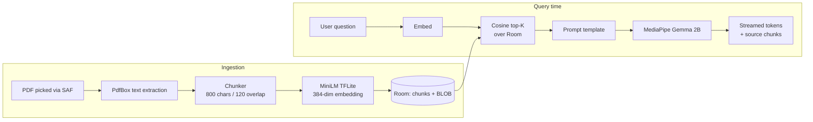

<div align="center">

# PocketSage

**A fully offline, on-device RAG app for Android.**
Ask questions about any PDF — your data never leaves the phone.

[](LICENSE)
[](https://kotlinlang.org/)
[](https://developer.android.com/)
[](#contributing)
[](../../actions)


</div>

---

## Why PocketSage exists

Most "chat with your PDF" tools ship your documents to a remote server. That's fine for marketing copy, but a problem for medical records, legal filings, financial statements, and the kinds of documents people most want a private assistant for.

PocketSage runs the **entire RAG pipeline on the device** — embeddings, vector search, and LLM inference all happen locally on your Android phone. Airplane mode works. Your documents stay on your hardware. The model weights live in your app sandbox.

It's also a working reference for **Modern Android Development (MAD Skills)** done well: Compose, Hilt, Room, Coroutines, MVVM, and clean separation between data, domain, and UI layers — applied to a non-trivial ML problem.

## Features

- **100% offline** — no network calls, ever. Verified by Android's network restrictions.
- **PDF ingestion** — pick any PDF from your device; PocketSage extracts, chunks, and embeds it locally.
- **Semantic search** — TFLite `all-MiniLM-L6-v2` produces 384-dim embeddings stored as BLOBs in Room.
- **On-device LLM** — Gemma 2B (INT4, ~1.3 GB) running through MediaPipe's `LlmInference` API.
- **Streaming answers** — tokens stream into the UI as they're generated, with retrieved sources shown alongside each answer.
- **Private by design** — model weights and document embeddings live only in your app's sandbox storage.

## Architecture



Three clean layers throughout: `data/` owns persistence and ML runtimes, `domain/` owns the RAG pipeline and pure interfaces, `ui/` is Compose with one ViewModel per screen.

## Tech stack

| Layer | Choice | Why |
| --- | --- | --- |
| UI | Jetpack Compose + Material 3 | The MAD Skills default; dynamic color on API 31+. |
| Architecture | MVVM, single Activity, Navigation Compose | Standard, testable, recruiter-recognisable. |
| DI | Hilt | First-party, less boilerplate than Dagger. |
| Persistence | Room (SQLite) | Embeddings stored as `BLOB`; cosine in Kotlin. |
| Embeddings | `all-MiniLM-L6-v2` via TFLite | 22 MB, 384-dim, well-benchmarked, runs anywhere. |
| PDF parsing | `pdfbox-android` | Mature port; handles most consumer PDFs. |
| LLM | MediaPipe `LlmInference` + Gemma 2B | Google's official on-device LLM API. INT4 quant. |
| Async | Coroutines + Flow | Streaming tokens map cleanly onto `callbackFlow`. |

## How RAG works here, in three paragraphs

When you add a PDF, PocketSage extracts the text, splits it into ~800-character overlapping chunks, embeds each chunk with a tiny BERT-family model (MiniLM), and stores the resulting 384-dimensional vectors as raw bytes in a Room table. This step is one-time per document and runs in the background with progress reported to the UI.

When you ask a question, the same embedding model converts your question into a vector. The app then computes cosine similarity between the question vector and every stored chunk, takes the top four matches, and stitches them into a prompt template that explicitly tells the LLM to answer only from the supplied context.

The prompt is fed to Gemma 2B running in MediaPipe's `LlmInference` runtime, which streams tokens back through a callback. Each token is appended to a `StateFlow<String>` that the chat screen renders in real time, with the retrieved chunks shown beneath each answer so you can verify the model isn't hallucinating.

## Quick start

```bash
git clone https://github.com/umerdilpazir/pocketsage.git
cd pocketsage
```

You need two model files that aren't checked into the repo (they're large and have their own licenses):

1. **Embedding model** — download `all-MiniLM-L6-v2.tflite` (~22 MB) from [the Hugging Face model card](https://huggingface.co/sentence-transformers/all-MiniLM-L6-v2) along with `vocab.txt`. Place both at `app/src/main/assets/embedding/`.
2. **LLM** — download `gemma2b.task` (~1.3 GB) from [Kaggle's MediaPipe Gemma page](https://www.kaggle.com/models/google/gemma/frameworks/tfLite). Side-load the file onto your device; PocketSage's first-run screen will let you pick it from the file system and copy it into app-private storage.

Then:

```bash
./gradlew installDebug
```

Open the app, tap the **+** button to add a PDF, and ask away.

## Roadmap

The v0.1 milestone ships a working end-to-end RAG loop. After that, the goal is to keep the codebase **legible** rather than dense — every addition should be something a reader can understand without trawling the whole repo.

Help wanted on any of these:

- **`good first issue`** — Settings screen with sliders for chunk size, overlap, and top-K.
- **`good first issue`** — Empty-state and error-state polish across both screens.
- **`help wanted`** — ANN index (Hnswlib JNI or ObjectBox vector search) once chunk count > a few thousand.
- **`help wanted`** — Cross-encoder re-ranker over the top 20 → top 4.
- **`help wanted`** — Multi-turn chat with rolling summarization.
- **`help wanted`** — OCR for scanned PDFs (ML Kit Text Recognition).
- **`research`** — Pluggable LLM runtime: llama.cpp via JNI as an alternative to MediaPipe.

## Contributing

Contributions are genuinely welcome — whether you're an Android dev curious about on-device ML, an ML engineer who wants to learn Compose, or a documentation hawk.

The fastest way in:

1. Read [`CONTRIBUTING.md`](CONTRIBUTING.md) — it covers the architecture, testing approach, and PR conventions.
2. Pick an issue tagged `good first issue` or `help wanted`. Each one has a clear acceptance checklist.
3. Open a draft PR early. Code review is collaborative here, not adversarial.

If you want to propose something larger that isn't on the roadmap, open an issue with a short design sketch first. Saves everyone time.

We follow [Conventional Commits](https://www.conventionalcommits.org/) (`feat:`, `fix:`, `docs:`, `refactor:`...) and use `ktlint` + `detekt` in CI. Both run with `./gradlew check`.

## Limitations (honest version)

- Cosine similarity is brute-force — fine for thousands of chunks, not millions.
- Single-turn Q&A; no conversation memory yet.
- Image-only / scanned PDFs aren't handled (no OCR in v0.1).
- Gemma 2B is a small model. Expect competent extractive answers, not deep reasoning.
- First model load takes ~5–10 seconds on mid-range devices. Subsequent queries are fast.

## License

[MIT](LICENSE) — do whatever you want, but don't blame me. Note that the embedding model is Apache 2.0 and Gemma has its own [usage terms](https://ai.google.dev/gemma/terms) — check both before shipping a derivative product.

## Acknowledgements

This project stands on the shoulders of [MediaPipe](https://github.com/google-ai-edge/mediapipe), [TensorFlow Lite](https://www.tensorflow.org/lite), [sentence-transformers](https://www.sbert.net/), [PdfBox-Android](https://github.com/TomRoush/PdfBox-Android), and the Android team's [MAD Skills](https://developer.android.com/series/mad-skills) series.

---

<div align="center">

If PocketSage is useful to you, a star on the repo helps others find it.

</div>
